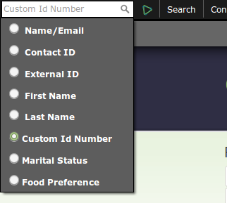
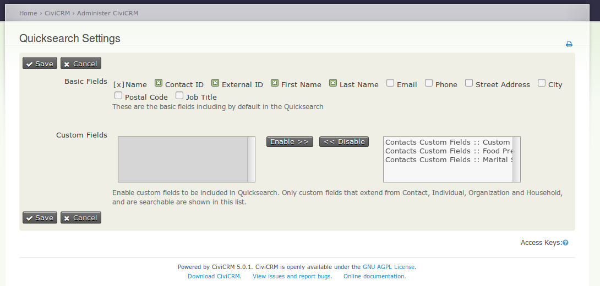

# com.ixiam.modules.quicksearch



Customize CiviCRM's QuickSearch
- Hide Contact's basic fields that are not normally used in a quicksearch
- Add custom field in the QuickSearch

The extension is licensed under [AGPL-3.0](LICENSE.txt).

## Requirements

* PHP v5.6+ / PHP v7.0+
* CiviCRM 4.7+ / 5.0+

## Installation (Web UI)

This extension has not yet been published for installation via the web UI.

## Installation (CLI, Zip)

Sysadmins and developers may download the `.zip` file for this extension and
install it with the command-line tool [cv](https://github.com/civicrm/cv).

```bash
cd <extension-dir>
cv dl com.ixiam.modules.quicksearch@https://github.com/ixiam/com.ixiam.modules.quicksearch/archive/master.zip
```

## Installation (CLI, Git)

Sysadmins and developers may clone the [Git](https://en.wikipedia.org/wiki/Git) repo for this extension and
install it with the command-line tool [cv](https://github.com/civicrm/cv).

```bash
git clone https://github.com/ixiam/com.ixiam.modules.quicksearch.git
cv en quicksearch
```

## Usage

1. Install extension
2. Go to the Menu **Administer / Customize Data and Screens / QuickSearch Settings** or url *civicrm/admin/quicksearch*
3. Disable basic field to be hidden in quiecsearck or add custom field to be shown. Only custom fields set as *Is Searcheable* are available to be selected
4. Save and start quicksearching!



## Known Issues

1. Search by Name/Email (default) is not supported due to **Contact.getlist** api call doesn't work with *sort_name* input field. Issue [#1](https://github.com/ixiam/com.ixiam.modules.quicksearch/issues/1)
2. When searching by custom field after entering a text, if the user presses enter, the next page is the Advanced Search, but without the filters populated as expected. It works with basic fields. Issue [#2](https://github.com/ixiam/com.ixiam.modules.quicksearch/issues/2)
3. If a custom field is renamed after included in the quicksearch, to update the label in the tooltip, the quicksearch settings form must be re-saved. This is because the custom field label is not beign populated from db every call to avoid overhead.
